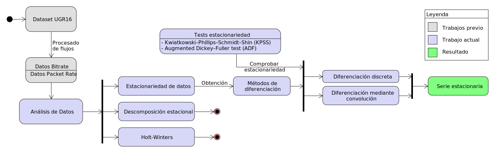
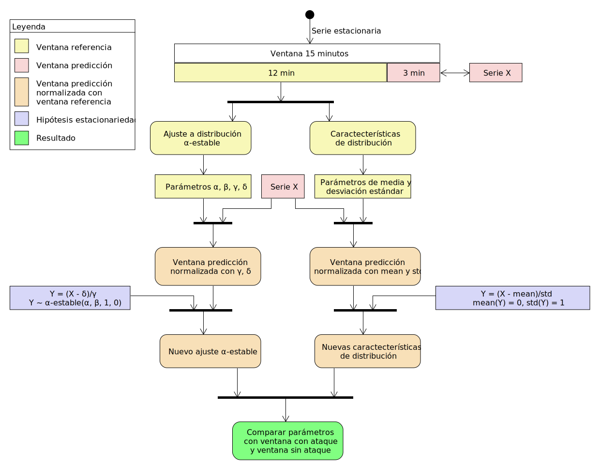

Este repositorio contiene todo el código que se fue desarrollando durante la elaboración del trabajo de fin de grado (TFG) titulado "Aplicación de técnicas de análisis de series temporales a tráfico de red".

La organización del repositorio es la siguiente:

El directorio `ugr16` contiene el [dataset](https://nesg.ugr.es/nesg-ugr16/) de la Universidad de Granada que ya ha sido procesado en trabajos anteriores, convirtiéndolo de datos de flujo a representaciones de _bitrate_ y _packet rate_.

El directorio `informe` contiene la memoria en formato LaTeX que se ha desarrollado. Este informe utiliza la plantilla proporcionada por la Universidad Autónoma de Madrid (UAM), contenida en el directorio `referencia`.

El directorio `matlab` contiene todo el código MatLab que se ha utilizado, incluyendo todas las pruebas que se han realizado. El archivo más importante es `alpha_fit_normalize.m` que computa los ajustes alfa-estables de una serie de datos proporcionados.

Finalmente, el directorio `python` está compuesto de la mayoría de las pruebas que se han realizado. Al tener que realizar numerosas pruebas rápidas, la organización de este directorio está lejos de ser adecuada. Por tanto, en la subcarpeta `python/src` se recogen todos los scripts utilizados específicamente para la generación del informe.

Es importante recalcar que las rutas de los archivos que se utilizan para cargar los datos son relativas y tendrán que ser correctamente configuradas para que funcionen adecuadamente.

Para una comprensión general del proyecto, a continuación se muestran dos diagramas que representan el trabajo realizado:

En el diagrama anterior se especifica cómo hemos llegado hasta obtener una serie estacionaria con los datos de entrada, que nos serán de utilidad para obtener predicciones.

Con este último diagrama del procesado de datos, se obtienen algunos parámetros que posteriormente se utilizan para la detección de una anomalía en el tráfico. A continuación se muestra un diagrama de la distribución que siguen todos los parámetros obtenidos. El rojo se ha utilizado para los valores de los parámetros cuando la ventana está bajo ataque, mientras que el azul se utiliza cuando no hay ataque. Los parámetros diferenciadores parecen ser _mean_ y delta.

